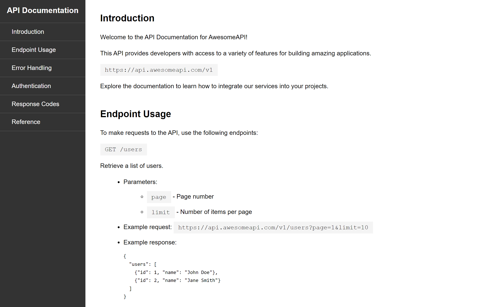

# API Documentation Page

This is a Certification Project for freeCodeCamp Responsive Web Design course.

This API and its documentation are fictional and created for illustrative purposes only. The URLs, endpoints, and details provided are placeholders and do not represent a real API.

## Table of Contents

- [Screenshots](#screenshots)
- [Deployment](#deployment)
- [Usage](#usage)
- [Questions](#questions)

## Screenshots

## Deployment

[API Documentation Page](https://zolotavina.github.io/documentation-page/)

## Usage

Click on the [link](https://zolotavina.github.io/documentation-page/) to access an API Documentation Page.

## Questions

Open an issue if you have any questions about the repo. You can find more of my work [here](https://github.com/zolotavina).